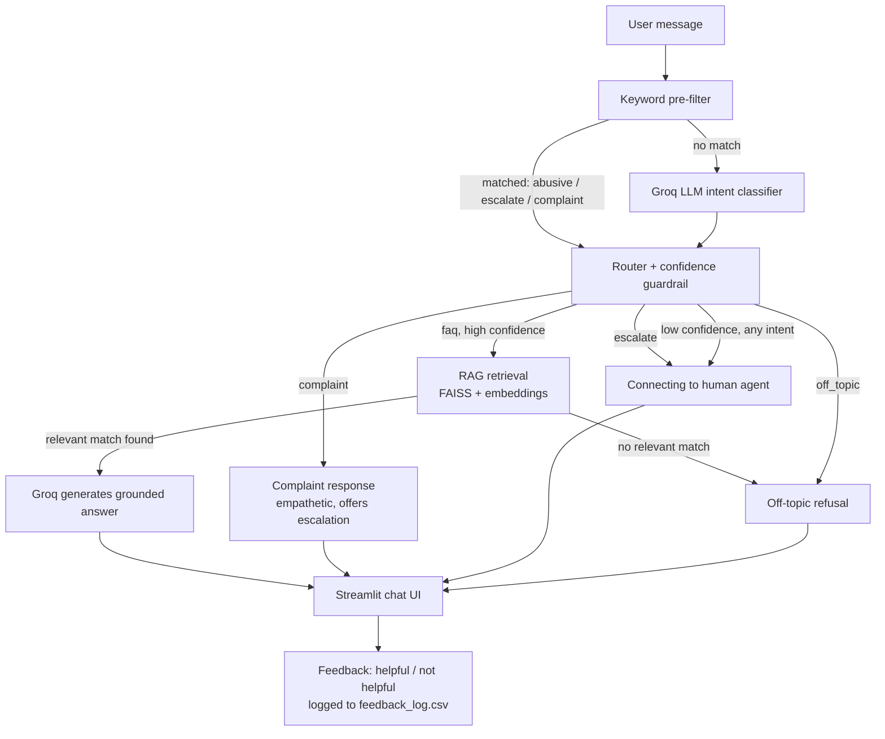

# Care Intelligence Support Assistant

An AI support assistant for **Care Intelligence** (fictional healthcare-AI
vendor) that answers customer questions from a FAQ knowledge base, detects
intent, applies guardrails, and routes conversations to the right flow —
FAQ answer, complaint handling, human escalation, or a polite off-topic
refusal.

---

## Architecture



**Flow, in words:**

1. A message comes in. A cheap keyword pre-filter checks for obviously
   abusive language, explicit escalation requests ("talk to a human"),
   or common complaint phrasing — these skip the LLM entirely.
2. Anything left goes to a Groq-hosted LLM for intent classification
   into one of four categories: `faq`, `complaint`, `escalate`, `off_topic`.
3. A confidence guardrail overrides low-confidence classifications to
   `escalate`, regardless of what was guessed.
4. `faq` intents go through RAG: the query is embedded, matched against
   the FAQ via FAISS, and if (and only if) a relevant match is found,
   Groq generates an answer grounded strictly in that match. No match
   → treated as `off_topic` instead of letting the model guess.
5. Every branch resolves to a response shown in the Streamlit chat UI,
   tagged with an intent badge, response time, and feedback buttons.

---

## Tool stack

| Layer | Tool | Why |
|---|---|---|
| LLM provider | **Groq** (`llama-3.3-70b-versatile`) | Fast inference for intent classification + generation |
| Agent orchestration | **CrewAI** (`Flow`) | Explicit state machine for branching intent-based routing |
| LLM routing layer | **LiteLLM** | Lets CrewAI's `LLM` class talk to Groq's API |
| Embeddings | **sentence-transformers** (`all-MiniLM-L6-v2`) | Free, local, no API cost for retrieval |
| Vector search | **FAISS** (`IndexFlatIP`) | In-memory cosine-similarity search over FAQ chunks |
| UI | **Streamlit** | Fast way to ship a real chat interface wired to Python backend |
| Data format | **Markdown** (`care_intelligence_faq.md`) | Knowledge base editable by non-engineers |
| Testing | **Python `unittest`-style assertions** | Guardrail tests run without any API key |

---

## Features

- **FAQ document** — 15 Q&A pairs covering products, pricing, security, integrations, and support.
- **RAG retrieval** — embeddings + FAISS search grounds every FAQ answer in actual document content.
- **Intent detection kept as its own explicit variable** — `state.intent`, never conflated with response text or retrieval logic.
- **Four-way routing** — FAQ / complaint / escalate / off-topic, each a distinct code path.
- **Guardrails** (full detail in `GUARDRAILS.md`):
  - closed intent vocabulary (no invented categories)
  - keyword pre-filter for abuse/escalation/complaints (runs before the LLM)
  - confidence-based escalation for uncertain classifications
  - gibberish detection
  - RAG relevance check (prevents hallucinated FAQ answers)
  - deterministic (non-LLM) canned responses for complaint/escalate/off-topic
  - polite, on-brand refusal for off-topic questions
- **Edge-case test suite** — 9 tests covering rude input, gibberish, ambiguous phrasing, and legitimate questions, runnable with no API key.
- **Branded chat UI** — Care Intelligence header/logo, live chat history.
- **Response time display** — measured around the real backend call, shown per message.
- **Feedback buttons** — helpful / not helpful, logged to `feedback_log.csv`.
- **Escalation display** — visually distinct red handoff box when a human agent is needed.

---

## File structure

| File | Purpose |
|---|---|
| `care_intelligence_faq.md` | FAQ knowledge base |
| `faq_loader.py` | Parses the `.md` file into structured records |
| `agent_core.py` | Intents, guardrails, canned responses (no LLM dependency) |
| `rag_retriever.py` | Embedding + FAISS search over the FAQ |
| `care_intelligence_flow.py` | CrewAI Flow: intent detection → routing → branches |
| `streamlit_app.py` | Branded chat UI, wired to the live flow |
| `test_edge_cases.py` | Guardrail tests, no API key required |
| `GUARDRAILS.md` | Guardrail documentation and known limitations |
| `requirements.txt` | Python dependencies |

---

## Setup

```bash
pip install -r requirements.txt
export GROQ_API_KEY="gsk_..."
```

## Run

```bash
# Chat UI
streamlit run streamlit_app.py

# Or command line
python care_intelligence_flow.py "Do you integrate with Epic?"

# Run guardrail tests (no API key needed)
python test_edge_cases.py
```

---

## Future extensions

- **Multi-turn memory** — carry conversation history into the intent classifier and generation prompt, so follow-up questions ("what about pricing for that?") resolve correctly.
- **Expand the knowledge base beyond FAQ** — ingest product docs, PDFs, or a real support-ticket archive; chunk longer documents instead of one-chunk-per-Q&A.
- **Swap FAISS for a managed vector DB** (Pinecone, Weaviate, pgvector) for scale beyond an in-memory index and multi-instance deployments.
- **Real ticketing integration** — instead of a canned "connecting to a human" message, actually open a ticket in Zendesk/Intercom/Freshdesk and hand off the conversation transcript.
- **Feedback analytics dashboard** — a second Streamlit page (or a Superset/Metabase dashboard) reading `feedback_log.csv` to surface which FAQ answers get marked "not helpful" most often.
- **Guardrail regression suite in CI** — run `test_edge_cases.py` on every commit; expand the test set as real user queries reveal new edge cases.
- **Multilingual support** — detect query language and either translate or retrieve from a translated FAQ, matching CareBot's existing language support (English, Hindi, Spanish, French).
- **Confidence/relevance threshold tuning** — replace the by-inspection thresholds with values tuned against a labeled evaluation set of real customer questions.
- **Streaming responses** — stream the Groq generation token-by-token into the Streamlit UI instead of waiting for the full response.
- **Auth + per-user history** — persist conversations per logged-in user instead of per browser session.
- **Model fallback** — if Groq is unavailable or rate-limited, fall back to a secondary provider (e.g. via LiteLLM's built-in fallback config) rather than surfacing an error to the user.
- **Voice/IVR front-end** — put the same flow behind a speech-to-text/text-to-speech layer for phone-based support.